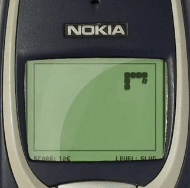

# Recreation of classic nokia game "snake"
For a weekend project I decided to task myself to build a small game using python to mimick and replicate the classic nokia game "snake". This is a game I played as a child so I particularly enjoyed recreating this classic game. Although this is a relatively simple application - it required I learn a lot about basic game development, something I'd never approached before.

<!--## Completed Project listed below-->

## What the classic game looks like

As we can see the design of this game is quite simple - to mimick the classic backlit monochrome graphic LCD display I downloaded GIMP photo editor and designed a background with the exact same colours as the screen default colours. I also placed a place line box around the screen as seen above. The score indicator and level indicator are added in later using python.